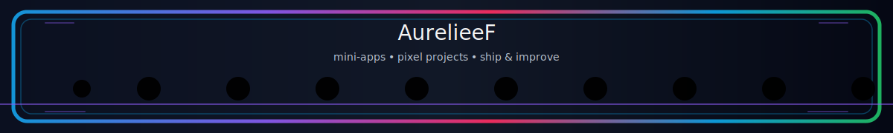

  

# 💫 About Me:
💻 Software Engineering student building practical mini-apps and more 🧩 I enjoy turning ideas into clean, working systems. ⚙️ I work across front-end, back-end, APIs, and databases. 🎨 I draw and transform sketches into interactive apps. 🎮 Exploring coding thing step by step.

# 💻 Tech Stack:
                      
# 📊 GitHub Stats:

 
 

### ✍️ Random Dev Quote

---

<!-- Proudly created with GPRM ( https://gprm.itsvg.in ) -->

  

