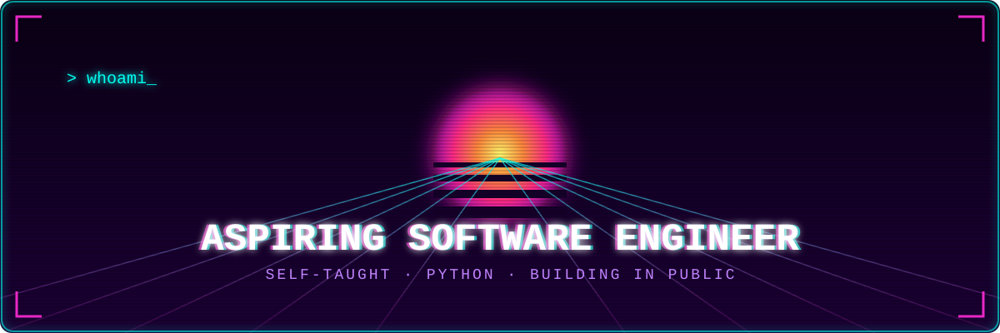
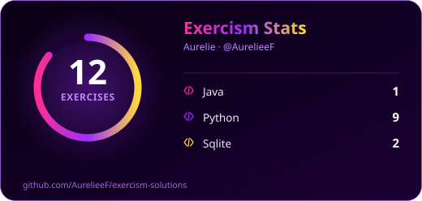
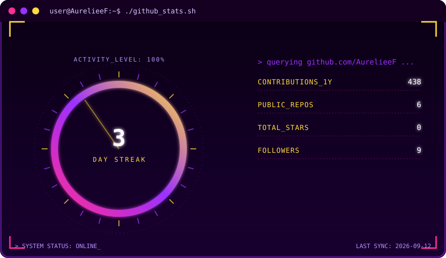

  

   

  

# 💫 About Me:
Focusing more on Python now... 
💻 Software Engineering student building practical mini-apps and more 
🧩 I enjoy turning ideas into clean, working systems.
 ⚙️ I work across front-end, back-end, APIs, and databases.
 🎨 I draw and transform sketches into interactive apps. 🎮 Exploring coding thing step by step.

# 💻 Tech Stack:
                   
#  🧠 LeetCode Stats:

  
  &nbsp;&nbsp;&nbsp;&nbsp;
  

<!--

-->

# 📊 GitHub Stats:

 
 

<!-- Proudly created with GPRM ( https://gprm.itsvg.in ) -->

  

  

